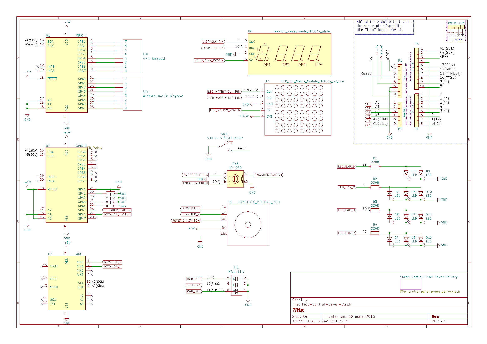

# kids-control-panel

This project is a spaceship-like control panel toy for kids (of all ages) allowing to:

* display characters from the alphanumeric keypad on the 7-segment display
* turn on LEDs in the 8x8 matrix when keys are pressed on the 4x4 keypad
* display some patterns using the 4-color LED bar
* use four tactile buttons to switch modes of operation for joystick and encoder:
  * control the LED bar
  * control the RGB LED's color
  * control LEDs on the 8x8 matrix
  
Repository contains FreeCAD designs for the casing (inteded for wood laser cutters), KiCAD schematics for the electronics part, and code for Arduino Uno R3 board.

